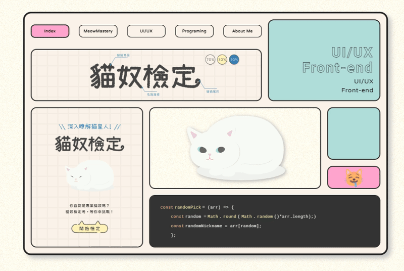
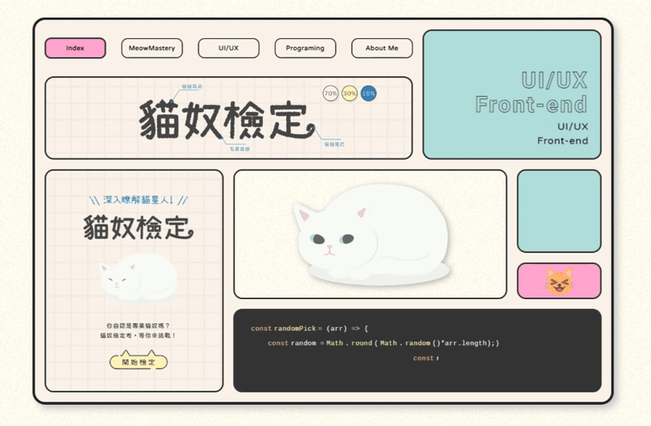
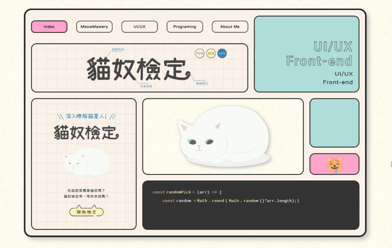
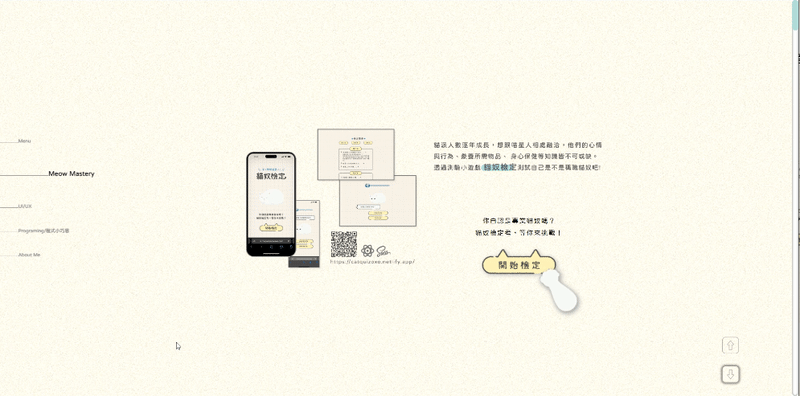
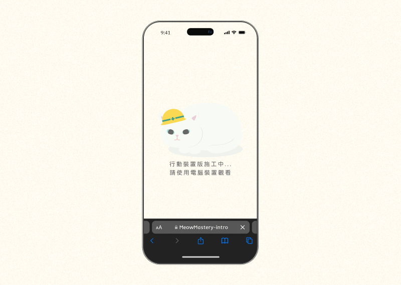

## 貓奴檢定 🐈 - 介紹網頁

> 介紹貓奴檢定的視覺設計及看不到的程式小巧思，將本來置於 Behance 等平台的平面內容，使用 Rive 及 CSS 加上一個有互動性的登陸頁，並監聽滾動事件，以優化使用者體驗。

### 專案特點 ✨ <code>#React</code> <code>#SCSS</code>

> 因為貓奴檢定為日式風格，加入同樣日系、近年設計趨勢 ── Bento design ， Hover 上不同區塊，會有不同的效果。

<br>

**🐈 在網頁動畫製作平台 Rive ，將貓奴檢定中的貓貓加以設計，利用滑鼠監聽事件加上互動效果**


```js
const { rive, setCanvasRef, setContainerRef } = useRive({
  src: "./images/cat-tracking.riv",
  stateMachines: "State Machine 1",
  layout: new Layout({
    fit: Fit.Contain,
    alignment: Alignment.Center,
  }),
  autoplay: true,
});

const numX = useStateMachineInput(rive, "State Machine 1", "mouseX", 50);
const numY = useStateMachineInput(rive, "State Machine 1", "mouseY", 50);
```

<br>

**🐈 UIUX 連結處採浮動效果，讓物件稍微超出區塊格線，增加立體感**


<br>

**🐈 自我介紹連結處採透視效果**


<br>

**🐈 在空白區放上貓貓 emoji 作為小彩蛋**


<br>

**🐈 貓貓 emoji 動畫則是今日運勢小互動**


<br>

**🐈 程式連結處則變換程式碼長度，表示專案開發中，不停修正改進的過程**


<br>

**🐈 內容頁的角落圖示，暗示可採用方向鍵滾動，優化使用者瀏覽體驗**


<br>

**🐈 考量內容為求職需要，在手機版呈現裝置建議圖示**

